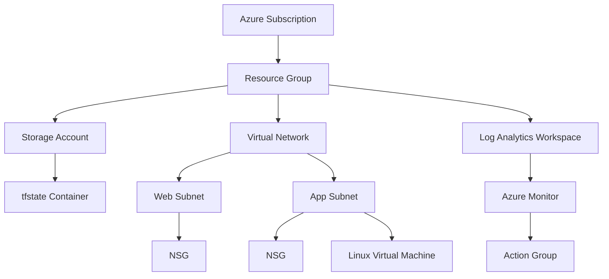

# Azure SRE Terraform Lab

## Project Overview

This project demonstrates how to provision Azure infrastructure using Terraform while following Infrastructure as Code (IaC) best practices.

The repository was built as part of my Azure SRE learning journey to improve my skills in:

- Terraform
- Azure Infrastructure
- Infrastructure as Code
- Azure Monitoring
- Modular Terraform Design
- Remote State Management

---

## Architecture

[#architecture](#architecture)

---

## Technologies Used

- Terraform
- Azure Resource Manager (AzureRM Provider)
- Azure CLI
- Git
- Visual Studio Code

---

## Infrastructure Components

- Resource Group
- Virtual Network
- Subnets
- Network Security Groups
- Storage Account
- Storage Container
- Log Analytics Workspace
- Action Group
- Linux Virtual Machine
- Remote State Backend

---

## Repository Structure
azure-sre-terraform-labs/
│
├── modules/
│   ├── resource-group/
│   ├── networking/
│   ├── storage/
│   ├── monitoring/
│   └── vm/
│
├── environments/
│   ├── dev/
│   │   ├── main.tf
│   │   ├── providers.tf
│   │   ├── versions.tf
│   │   ├── variables.tf
│   │   ├── terraform.tfvars
│   │   └── outputs.tf
│   │
│   └── uat/
│       ├── main.tf
│       ├── providers.tf
│       ├── versions.tf
│       ├── variables.tf
│       ├── terraform.tfvars
│       └── outputs.tf
│
├── README.md
└── .gitignore

## Progress

- [x] Day 1 - Resource Group
- [x] Day 2 - Networking
- [x] Day 3 - Storage
- [x] Day 4 - Remote State
- [x] Day 5 - VM
- [ ] Day 6 - Monitoring
- [ ] Day 7 - Modules
- [ ] Day 8 - Final Project